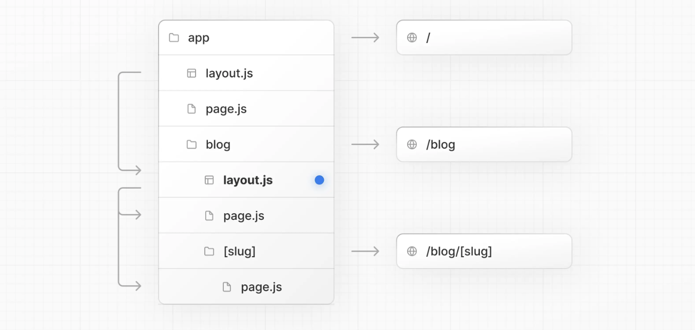

<h1> 📚 Next.js 4주차 학습정리

## 💡 How to create layouts and pages
- Next.js는 **파일 시스템 기반** 라우팅을 이용함. (폴더와 파일을 이용해서 라우트를 정의할 수 있다는 뜻)
    - Next.js에선 파일 이름과 위치만 잘 정하면 자동으로 URL 경로(route)를 만들어줌.

### 📍  Creating a page 
- **page** : 특정 경로(route)에 렌더링되는 UI. 
- Next.js에서는 app 폴더 안에 page.tsx 또는 page.js 파일을 만들고, 거기에 React 컴포넌트를 기본 export 하면 그게 곧 해당 경로의 페이지가 됨.

```
export default function Page() {
  return <h1>Hello Next.js!</h1>
}
```
- app 디렉토리 안에 page 파일을 만들고, 그 안에서 React 컴포넌트를 기본(default)으로 export


### 📍  Creating a layout
- **layout** : 여러 페이지에서 공유되는 UI (ex. 공통으로 사용되는 헤더, 네비게이션 바 등)
- 페이지를 이동해도 레이아웃은 상태를 유지하고, 인터랙티브한 상태도 그대로이며, 다시 렌더링되지 않음.

```
// app/layout.tsx
export default function RootLayout({ children }: { children: React.ReactNode }) {
  return (
    <html>
      <body>
        <header>공통 헤더</header>
        <main>{children}</main>   // <-- 여기에 인덱스 페이지가 들어감!
        <footer>공통 푸터</footer>
      </body>
    </html>
  );
}
```

```
// app/page.tsx (인덱스 페이지)
export default function HomePage() {
  return <div>여기가 인덱스 페이지야!</div>;
}
```

이렇게 해두면 브라우저에서 /에 접속했을 때 Next.js가 알아서

```
<RootLayout>
  <HomePage />
</RootLayout>
```

이런 구조로 자동으로 감싸서 보여준다. 

- layout.tsx는 외부 틀 (공통 구조)
- page.tsx는 내부 내용 (화면마다 달라지는 부분)

### 정리 
- app/layout.tsx는 모든 페이지의 기본 틀이 되는 루트 레이아웃
- 루트 레이아웃은 무조건 있어야 하고, 그 안에는 <html>과 <body> 태그를 직접 작성해야 함. -> Next.js가 이걸 바탕으로 전체 페이지 구조를 만들어줌.

### 📍 Creating a nested root

- **nested route(중첩 라우트)** : 여러개의 URL segment로 구성된 라우트 
  - ```/blog/[slug]```는 세개의 조각으로 나뉨. 
    - ```/``` : 루트 세그먼트
    - ```blog``` : 중간 세그먼트
    - ```[slug]``` : 마지막 세그먼트 <- 보통 동적 라우팅에 사용 

- Next.js에서는 
  - folders : URL 경로를 정의하는데 사용 (폴더 이름이 URL 경로의 한 부분이 된다)
  - files : 그 경로에서 보여질 UI를 만드는데 사용 

- 중첩 라우트를 이용하고 싶다면 폴더를 서로 중첩해서 사용하면 됨. 
  -  /blog 경로를 만들고 싶다면, app 디렉토리 안에 blog라는 폴더를 만들면 됨
  - /blog 경로를 실제로 열 수 있게 하려면, 그 blog 폴더 안에 page.tsx 파일을 추가!

```
/app
 └── blog
      └── page.tsx   ← 여기 파일이 실제로 /blog 페이지로 보이게 됨!
```

- 폴더 이름을 대괄호([ ])로 감싸면 **동적 라우트 세그먼트(dynamic route segment)** 가 만들어짐. 
  - 데이터를 기반으로 여러 개의 페이지를 만들 때 사용. (블로그 글, 제품 상세 페이지 등)

### 📍  Nesting Layouts
- 기본적으로 폴더 구조에 따라 layout도 중첩됨
- 중첩 레이아웃 구성 
  - 특정 경로(폴더)에 layout.tsx 파일을 추가하면, 그 경로에만 적용되는 레이아웃을 만들 수 있움.


-  두 개의 레이아웃(루트 레이아웃과 블로그 레이아웃)을 같이 사용한다면, ```app/layout.js```에 있는 루트 레이아웃이 ```app/blog/layout.js``` 에 있는 블로그 전용 레이아웃을 감싼다.
- 블로그 레이아웃은 ```/blog``` 페이지와 ```/blog/[slug]``` 페이지를 감싼다.

```
export default function BlogLayout({
  children,
}: {
  children: React.ReactNode
}) {
  return <section>{children}</section>
}
```
1. ```BlogLayout``` 이라는 레이아웃 컴포넌트 만든다 
  → 블로그 관련 페이지들에만 적용되는 틀이 되는 레이아웃

2. ```children``` : 이 레이아웃 안에 들어갈 실제 페이지 내용
  - ```/blog/page.tsx``` 나 ```/blog/[slug]/page.tsx``` 등

3. 브라우저에는 이렇게 렌더링됨
```
<section>
  <!-- blog/page.tsx 내용 -->
</section>
```


### 📍 Linking between Pages 
- Next.js에서는 <Link> 컴포넌트를 사용해서 페이지 간 이동을 할 수 있다.
  -  ```<Link> ``` : 기본 HTML ```<a>``` 태그를 확장한 Next.js 전용 컴포넌트
  - prefetching (미리 로딩하는 것)과 클라이언트 사이드 navigation 제공 

```
import Link from 'next/link';

<Link href="/blog">블로그로 이동</Link>

```
- next/link에서 <Link>를 불러오고, href 속성을 넣어줌.

- ```<Link>```는 Next.js 앱에서 경로 간 이동을 할 때 가장 기본적이고 권장되는 방법이지만, 좀 더 복잡한/동적인 이동이 필요할 때는  ```useRouter``` 훅을 사용할 수 있음. 


