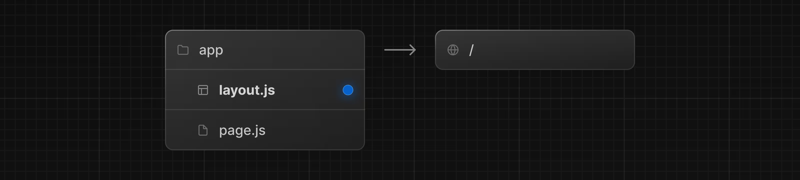
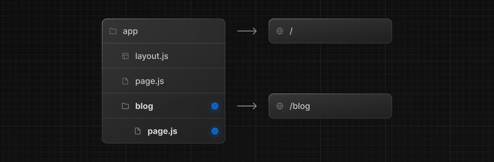
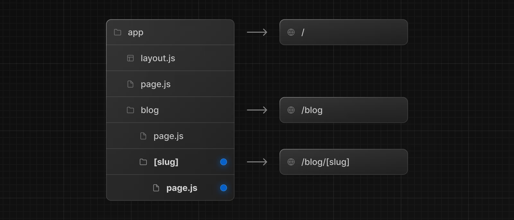
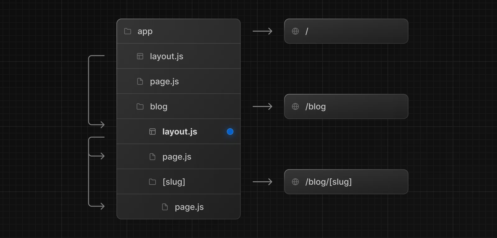
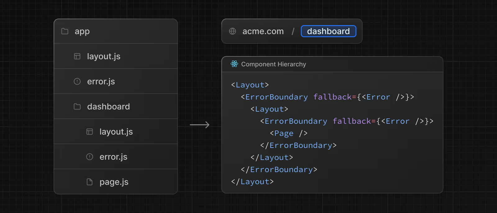

# Routing(1)

## Layout and Templates

- Next는 파일 기반 라우팅을 사용하고 있음
- 폴더와 파일을 사용하여 라우팅(경로) 정의 가능

### 페이지 만들기

- 페이지를 생성하기 위해선 `app`디렉토리 안에 `page.tsx`를 만들면 생성
  - 아래 사진은 `/`디렉토리에 페이지를 만드는 경우인데, 다른 디렉토리에 만들고 싶은 경우 원하는 이름의 폴더를 생성하고 `page.tsx`를 적용하면 해당 경로로 페이지가 생성된다.
    

### 레이아웃 만들기

- 레이아웃은 여러 페이지 간에 공유되는 UI
  - 레이아웃은 고정된 상태로 페이지(컴포넌트)만 교체됨
- `layout.tsx`에서 컴포넌트를 내보내서 레이아웃을 정의함
  - 레이아웃은 페이지의 레이아웃이 될 수 있게 children props를 받아야 함
    

```typescript
// 이 예시 코드는 앱 디렉토리의 루트에 정의되어 있음 -> 루트 레이아웃
// 루트 레이아웃은 필수이고 html와 body 태그가 지정되어야 함
export default function DashboardLayout({
  children,
}: {
  children: React.ReactNode;
}) {
  return (
    <html lang="en">
      <body>
        {/* Layout UI */}
        {/* Place children where you want to render a page or nested layout */}
        <main>{children}</main>
      </body>
    </html>
  );
}
```

### 중첩 라우팅 만들기

- 중첩 라우팅은 여러 URL 세그먼트로 구성된 경로임
- 예를 들어 `/blog/[slug]`는 /(루트 세트먼트) blog(세그먼트) [slug](리프 세그먼트) 세 가지로 구성됨
- NextJS에서 폴더는 URL 세그먼트에 매핑되는 경로 세그먼트를 정의하는 데 사용
- 폴더 안에 폴더를 두어 중첩 라우팅을 정의할 수 있음
  

- 만약 특정 블로그에 대한 경로(동적)를 만들고 싶다면 대괄호 [] 를 이용해 페이지 파일을 추가하면 사용 가능함
  

```typescript
// /blog/[slug]
export default function Page(({
  params,
}: {
    //아래와 같이 정의해서 slug 사용가능
  params: Promise<{ slug: string }>
})) {
    const { slug } = await params
  return <h1>Hello, Blog Post Page!</h1>;
}
```

### 중첩 레이아웃

- 레이아웃도 서로 중첩하여 레이아웃에 레이아웃을 감쌀 수 있음
- 원하는 폴더(라우트)에 `layout.tsx`를 추가하여 적용가능
  

```typescript
export default function BlogLayout({
  children,
}: {
  children: React.ReactNode;
}) {
  return <section>{children}</section>;
}
```

### 페이지 간 연결하기

- `<Link>`태그를 사용하면 페이지간 이동을 할 수 있음
  - HTML의 `a`태그를 확장
  - 프리페칭과 클라이언트 탐색 기능을 제공
- href를 통해 다른 페이지를 연결할 수 있음

```typescript
import Link from "next/link";

export default async function Post({ post }) {
  const posts = await getPosts();

  return (
    <ul>
      {posts.map((post) => (
        <li key={post.slug}>
          <Link href={`/blog/${post.slug}`}>{post.title}</Link>
        </li>
      ))}
    </ul>
  );
}
```

- Link 컴포넌트 이외에도 useRouter를 사용해 페이지간 이동을 조절할 수 있음

## Linking and Navigating

- NextJS에서 라우트를 이동할 수 있는 방법은 4가지가 있음
  1. Link
  2. useRouter
  3. redirect
  4. History API

### `Link` 컴포넌트 사용하기

- 프리페칭과 클라이언트 사이드에서 라우트를 이동하는 기능을 제공하기 위한 a 태그를 확장한 형태
  - a태그에서 제공하는 기능(새창 열림 등)을 사용가능
- NextJS에서 라우트를 이동하기 위한 가장 기본적이고 권장하는 방법
- `href` 속성을 이용해 해당 라우트로 이동할 수 있음

```typescript
import Link from "next/link";

export default function Page() {
  return <Link href="/dashboard">Dashboard</Link>;
}
```

### `useRouter` 사용하기

- 클라이언트 컴포넌트에서 다른 라우트로 넘어가는 데에 사용할 수 있는 방법
- 가능하면 `Link` 컴포넌트 사용하는 걸 권장

```typescript
"use client";

import { useRouter } from "next/navigation";

export default function Page() {
  const router = useRouter();

  return (
    <button type="button" onClick={() => router.push("/dashboard")}>
      Dashboard
    </button>
  );
}
```

### `redirect` 함수 사용하기

- 서버 컴포넌트에선 `Link` 대신 `redirect`를 사용할 수 있음
  - `307(임시 리디렉션)` HTTP 상태 코드를 반환
  - 서버 액션에서는 `303(기타 참조)`를 반환
  - -> POST 요청시 성공 페이지로 나타나는데에 일반적으로 사용함
- `redirect`는 내부적으로 오류를 발생시키기 때문에 `try/catch`외부에서 사용되어야 함
- 서비스 내부 라우트 뿐만 아니라 외부 링크도 사용 가능

```typescript
import { redirect } from "next/navigation";

async function fetchTeam(id: string) {
  const res = await fetch("https://...");
  if (!res.ok) return undefined;
  return res.json();
}

export default async function Profile({
  params,
}: {
  params: Promise<{ id: string }>;
}) {
  const { id } = await params;
  if (!id) {
    redirect("/login");
  }

  const team = await fetchTeam(id);
  if (!team) {
    redirect("/join");
  }

  // ...
}
```

### History API 사용하기

- 기본적으로 제공하는 `window.history.pushState`와 `window.history.replaceState` 를 사용할 수 있음
- `pushState`와 `replaceState`를 호출하면 Next의 라우터와 바로 연동되어 `usePathname`과 `useSearchParam`에도 바로 반영됨

#### `window.history.pushState`

- 브라우저의 history stack에 새로운 항목을 추가할 수 있음
  - 이전 상태로 돌아가기 가능

```typescript
"use client";

import { useSearchParams } from "next/navigation";

export default function SortProducts() {
  const searchParams = useSearchParams();

  function updateSorting(sortOrder: string) {
    const params = new URLSearchParams(searchParams.toString());
    params.set("sort", sortOrder);
    window.history.pushState(null, "", `?${params.toString()}`);
  }

  return (
    <>
      <button onClick={() => updateSorting("asc")}>Sort Ascending</button>
      <button onClick={() => updateSorting("desc")}>Sort Descending</button>
    </>
  );
}
```

#### `window.history.replaceState`

- 브라우저의 Histroy Stack에서 현재 항목을 바꾸기 위해 사용
- 이전 상태로 돌아갈 수 없음

```typescript
"use client";

import { usePathname } from "next/navigation";

export function LocaleSwitcher() {
  const pathname = usePathname();

  function switchLocale(locale: string) {
    // e.g. '/en/about' or '/fr/contact'
    const newPath = `/${locale}${pathname}`;
    window.history.replaceState(null, "", newPath);
  }

  return (
    <>
      <button onClick={() => switchLocale("en")}>English</button>
      <button onClick={() => switchLocale("fr")}>French</button>
    </>
  );
}
```

### Routing와 Navigation은 어떻게 동작할까?

- 앱 라우터에서는 라우팅과 네비게이션에 하이브리드 방식을 사용
  - 서버에서는 앱 코드가 라우트 세그먼트 별로 자동으로 코드 분할
  - -> 클라이언트에서는 NextJS가 라우트 세그먼트를 프리페치하고 캐싱
    - 새 경로로 이동할 때 페이지를 새로고침하지 않고 변경되는 라우트 세그먼트만 다시 렌더링 -> 탐색 환경과 성능 개선

#### 코드 스플리팅(코드 분할)

- 코드 분할을 사용하면 코드를 더 작은 번들로 분할해서 성능이 향상됨(번들 파일을 가져오는데에 시간이 빨라지기 때문)
- 서버 컴포넌트를 사용하면 코드를 라우트 세그먼트 별로 자동으로 코드를 분할 -> 성능 향상!

#### 프리페칭

- 해당 라우트에 방문하기 전 백그라운드에서 미리 로드하는 방법
- 두 가지 방법으로 프리페칭을 진행함
  1. `Link` 컴포넌트
  - 해당 컴포넌트가 뷰포트(화면)에 보이면 해당 경로에 대해 프리페칭을 진행함
  2.  `router.prefetch`를 이용
  - `useRouter()`를 사용해서 프로그래밍적으로 프리페칭을 실행할 수 있음
- `Link`컴포넌트에 의해 프리페칭되는 방식은 해당 페이지가 `loading.js`가 있는지에 따라 다르게 작동
  - loading.js가 있는 경우 해당 페이지의 공통 컴포넌트만 가지고 오고 다른 부분은 loading.js를 보임
  - -> 전체 컴포넌트를 가지고 오면 너무 무겁고 속도가 오래 걸리기 때문에 성능은 높이면서 사용자 경험을 높이기 위해
- Link 컴포넌트에는 prefetch 라는 props가 있는데 boolean으로 종료할 수 있음

#### 캐싱

- Next에는 Router Cache라는 인메모리 클라이언트 캐시가 있음
  - 사용자가 앱을 탐색할 때 미리 가져온 라우트와 방문한 라우트의 서버 컴포넌트 페이로드가 캐시에 저장
  - -> 탐색 시 캐시를 최대한 재사용하여 요청과 데이터 전송 횟수를 줄여 성능을 개선함

#### 부분 렌더링

- 공유되는 요소는 유지되고 변경되는 경로만 클라이언트에서 렌더링되는 것
- 특정 하위 페이지에서는 상위의 layout을 공유힘
  - 하위 페이지에서 변경이 발생했을 때 상위 layout은 유지되고 하위 페이지만 교체됨
  - 전체 페이지를 로딩할 필요가 없어지기 때문에 성능상 이점이 큼

#### Soft Navigating

- 변경된 세그먼트에 대해서만 렌더링을 하기 때문에 상위에서 사용하는 상태는 유지됨

#### 이전 페이지로 이동하기

- 스크롤 위치를 유지하고 라우터 캐시에서 경로 세그먼트를 재사용

#### pages/와 app/ 사이의 라우팅(페이지 라우터에서 앱 라우터로..)

- 자동으로 처리하고 왠만하면 오류 안 남!

## Error Handling

- 에러는 두 가지로 나눌 수 있음
  - 예상된 오류
    - 서버 액션에서 예상되는 오류에 대해 try/catch를 사용하지 않는 걸 추천함
    - 오류를 관리하고 클라이언트에 반환하고 싶다면 useActionState를 사용
  - 예상치 못한 오류
    - `error.tsx`나 `global-error.tsx`와 같은 에러 바운더리를 사용하여 관리

### 예상된 오류 관리하기

- 해당 오류는 유효성 검사나 요청 실패와 같이 정상적인 작동 중에 발생할 수 있는 에러
- 명시적으로 처리하여 클라이언트에 반환해야 함

#### 서버 액션에서 예상된 오류 처리하기

- `useActionState` 훅을 사용하여 오류 처리를 포함한 서버 액션의 상태를 관리할 수 있음
- 예상되는 오류에 대해 try/catch를 피하고 예외(알 수 없는 에러)를 제외한 모든 값은 반환값으로 해야 함

```typescript
"use server";

import { redirect } from "next/navigation";

export async function createUser(prevState: any, formData: FormData) {
  const res = await fetch("https://...");
  const json = await res.json();

  if (!res.ok) {
    return { message: "Please enter a valid email" };
  }

  redirect("/dashboard");
}
```

- 클라이언트에서 `useActionState`를 사용하여 해당 함수의 상태를 확인할 수 있음

```typescript
"use client";

import { useActionState } from "react";
import { createUser } from "@/app/actions";

const initialState = {
  message: "",
};

export function Signup() {
  const [state, formAction, pending] = useActionState(createUser, initialState);

  return (
    <form action={formAction}>
      <label htmlFor="email">Email</label>
      <input type="text" id="email" name="email" required />
      {/* ... */}
      <p aria-live="polite">{state?.message}</p>
      <button disabled={pending}>Sign up</button>
    </form>
  );
}
```

#### 서버 컴포넌트에서 예상된 오류 처리하기

- 오류 메시지를 렌더링하거나 `redirect`를 이용해 처리 가능

```typescript
export default async function Page() {
  const res = await fetch(`https://...`);
  const data = await res.json();

  if (!res.ok) {
    return "There was an error.";
  }

  return "...";
}
```

### 예상치 못한 오류 관리하기

- 정상적인 흐름에서는 발생하면 안되는 버그나 문제
- 에러를 던져서 처리해야 함

- 일반적인 방법: 루트 레이아웃에서 error.tsx 사용
- 선택적인 방법: 세부 세그먼트에서 error.tsx 사용
- 흔하지 않은 방법: 루트 레이아웃에서 global-error.tsx 사용

#### 에러 바운더리 사용하기

- 하위 컴포넌트에서 발생한 에러를 캐치해서 충돌한 컴포넌트 대신 폴백 UI를 반환함
- error.tsx를 생성해서 예상치 못한 에러를 관리할 수 있음

```typescript
"use client"; // 에러 바운더리는 클라이언트 컴포넌트

import { useEffect } from "react";

export default function Error({
  error,
  reset,
}: {
  // Error를 전달 받음
  error: Error & { digest?: string };
  // 재시도 할 수 있는 함수
  reset: () => void;
}) {
  useEffect(() => {
    // Log the error to an error reporting service
    console.error(error);
  }, [error]);

  return (
    <div>
      <h2>Something went wrong!</h2>
      <button
        onClick={
          // Attempt to recover by trying to re-render the segment
          () => reset()
        }
      >
        Try again
      </button>
    </div>
  );
}
```

#### 중첩 라우트에서 에러 관리

- 에러는 가장 가까운 상위 에러바운더리에 표시됨
- 세분화된 에러 처리가 가능
  

#### 전역 에러 처리

- `app/global-error.js`를 정의하면 루트 레이아웃을 벗어난 에러 화면을 표시할 수 있음.
- 그러나 `html`과 `body`처리 꼭 해야함
