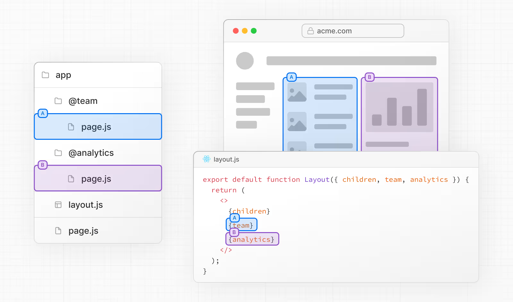

<h1> 📚 Next.js 5주차 학습정리 | Routing (2)

## 💡 Dynamic Routes

- URL 경로의 특정 세그먼트 이름을 미리 알 수 없을 때 사용하는 기능
  - 사용자가 작성한 블로그 게시글 페이지처럼 `post/123`, `post/abc` 등 경로가 **사용자 데이터**에 따라 달라질 경우에 적합.
- 동적 세그먼트는 요청 시점(request time) 혹은 빌드 시점(build time) 에 채워짐

폴더 이름을 `대괄호 []` 로 감싸는 방식으로 동적 세그먼트 생성.

- `[id]`, `[slug]`같은 형식 (변하는 값들이 들어올 자리 표시)

- 동적 세그먼트 값은 `params`라는 이름의 `props`로 전달됨.
- `params`를 사용할 수 있는 곳
  - `layout.tsx` , `page.tsx`, `route handler`, `generateMetadata()` 함수 등

### 📍 Example

```
export default async function Page({
  params,
}: {
  params: Promise<{ slug: string }>
}) {
  const { slug } = await params
  return <div>My Post: {slug}</div>
}
```

- params : `{ slug: string }` 타입의 비동기 객체 (= Promise)
- `await params`로 `slug` 값을 받아서 → `My Post: slug`값을 출력
  - ex. `/blog/a`에 접근 → `My Post: a`가 출력됨

### 📍 Good To Know

1. `params prop`은 **Promise 객체**이기 때문에, 값을 접근하려면 `async/await` 문법이나 React의 **use 함수**를 반드시 사용해야 한다.
2. Next.js 버전 14 이하에서는 params가 `동기적(synchronous) prop`이었기 때문에 바로 사용할 수 있었다. Next.js 15에서는 **하위 호환성(backwards compatibility)** 을 위해 여전히 동기적으로 접근하는 것이 가능하지만, 이 동작 방식은 앞으로 지원이 중단(deprecated)될 예정
3. `Dynamic Segments` = 기존 pages 디렉토리에서의 `Dynamic Routes`

### 📍 정적 파라미터 생성

- `generateStaticParams` 함수 : 동적 라우트 세그먼트와 함께 사용되어, 요청 시점(on-demand)이 아닌 **빌드 시점(build time)**에 정적으로 라우트를 생성할 수 있도록 해줌.

예시 코드

```
export async function generateStaticParams() {
  const posts = await fetch('https://.../posts').then((res) => res.json())

  return posts.map((post) => ({
    slug: post.slug,
  }))
}
```

### ⚡️ `generateStaticParams` 함수

- 동적 라우트와 함께 사용되어 빌드 시점에 정적으로 페이지를 생성할 수 있게 해주는 함수
- 요청 시마다 만드는 게 아니라 미리 만들어서 성능을 높임

```
export async function generateStaticParams() {
  const posts = await fetch('https://.../posts').then((res) => res.json())

  return posts.map((post) => ({
    slug: post.slug,
  }))
}
```

- 외부 API에서 글 목록을 받아오고, 각 글의 slug를 기반으로 정적 경로를 만듦

  - `/blog/hello`, `/blog/nextjs` 같은 페이지들은 미리 생성

- 💡 장점
- fetch 요청이 자동으로 메모이제이션됨 → 동일한 요청이 여러 번 있어도 한 번만 수행됨 → 빌드 시간 단축
- **Memoization** : 동일한 계산을 반복해야 할 경우, 결괏값을 메모리에 저장해 두었다가 꺼내어 씀으로써 중복 계산을 방지하는 기법 (넓게 말하면 캐싱의 일종으로 볼 수 있음)

### 📍 Catch All Segments (모든 하위 경로를 포괄하는 세그먼트)

- Dynamic Segments는 `[...folderName]` 이렇게 대괄호 안에 ... (점 세개)를 추가하면, 그 경로 이후의 모든 하위 경로를 한 번에 포괄할 수 있음

`app/shop/[...slug]/page.tsx`

- 경로 깊이에 상관없이 `/shop/` 이후의 모든 세그먼트를 배열 형태로 받아옴.


### 📍 Optional Catch All Segments (선택적 전체 포괄 세그먼트)

- Catch-all Segments는 기본적으로 특정 경로 이후의 모든 하위 경로를 포괄
- 값을 선택적으로 만들고 싶을 때는 [[...]] (대괄호 두 겹) 을 사용

`app/shop/[[...slug]]/page.tsx`

- `/shop`도 매칭됨. (하위 경로가 없어도 동작)


### 📍 TypeScript에서 Dynamic Routes `params` 정의하기

- TypeScript를 사용할 경우, 라우트에 따라 params 객체에 타입을 직접 지정할 수 있음
- 해당 경로에서 어떤 동적 세그먼트를 사용하는지에 따라 달라짐

```
export default async function Page({
  params,
}: {
  params: Promise<{ slug: string }>
}) {
  return <h1>My Page</h1>
}
```


## 💡 Parallel Routes (병렬 라우트)

- 하나의 레이아웃 안에서 여러 페이지를 동시에 또는 조건에 따라 렌더링할 수 있는 기능
- 특히나 앱 내에서 동적으로 바뀌는 영역이 많을 때 유용
  - dashboard 화면
  - 소셜 미디어의 피드/사이드바



- 왼쪽에는 `Team` 정보, 오른쪽에는 `Analytics` 정보

🌱 두 페이지를 각각 병렬로 렌더링하면서도 공통 레이아웃을 유지할 수 있다는 점이 장점.

### 📍 Slots

```
app/
├── @analytics/
│   └── page.tsx
├── @team/
│   └── page.tsx
└── layout.tsx

```

- `@폴더명` 형태로 폴더를 생성함으로써 Slot 정의
- `@analytics`, `@team` 두 개의 슬롯 생성

### ⚡️ 슬롯의 라우팅 구조

- 슬롯은 병렬 라우팅 과정에서 **공통 부모 레이아웃(layout.tsx)** 에 **props 형태** 로 전달된다.

```
export default function Layout({
  children,
  team,
  analytics,
}: {
  children: React.ReactNode
  analytics: React.ReactNode
  team: React.ReactNode
}) {
  return (
    <>
      {children}
      {team}
      {analytics}
    </>
  );
}
```

- `app/layout.tsx` 안에서 `@analytics`, `@team`에 해당하는 컴포넌트는 `children` 과 나란히 병렬로 렌더링됨

#### ⚠️ 주의

1. 슬롯은 라우트 세그먼트가 아님 => URL 경로에는 영향 ❌

- ex. 실제 경로가 `/@analytics/views`여도 URL은 `**/views**` 처럼 표시

2. 슬롯은 일반적인 `페이지(Page) 컴포넌트` 와 조합되어 최종적으로 하나의 화면을 구성함

3. 같은 라우트 세그먼트 수준에서, 정적 슬롯과 동적 슬롯을 혼합해서 사용할 수 ❌

- 슬롯 중 하나라도 동적(dynamically matched)이라면 해당 수준의 **모든 슬롯**이 동적이어야 함.
- ex. `@team`이 `[teamId]` 같은 동적 슬롯 -> `@analytics`도 `[analyticsId]`처럼 동적으로 바꿔야 함

### 📍 Active State와 Navigation 방식

## 💡 Intercepting Routes

### 📍
